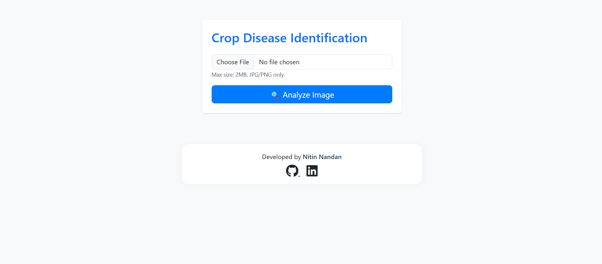
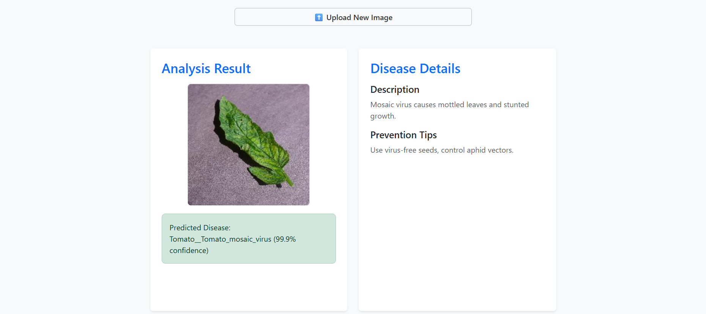
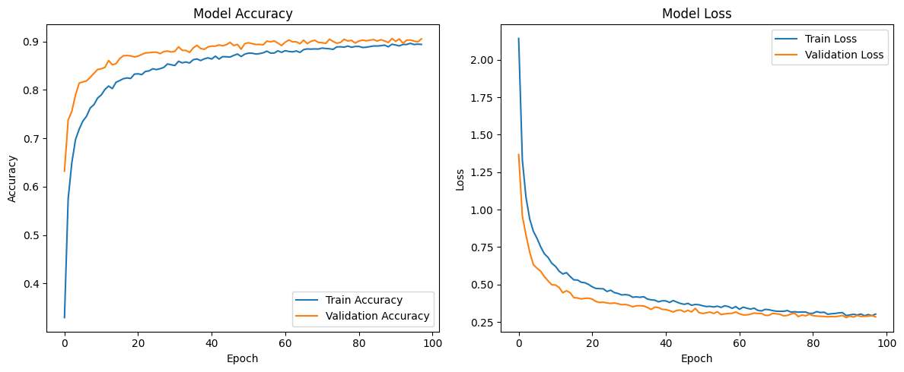

# 🌱 Crop Disease Identification

A user-friendly deep learning web app for identifying crop diseases from leaf images. Upload a photo of a leaf and instantly get the predicted disease, confidence score, and actionable prevention tips.

---

## Contents

* [Introduction](#-crop-disease-identification)
* [Prerequisites](#prerequisites)
* [Environment Setup & Usage](#environment-setup--usage)
* [How to Use the App](#how-to-use-the-app)
* [Model Training Details](#model-training-details)

---

## Prerequisites

* [Visual Studio Code](https://code.visualstudio.com/download) (with [Python](https://marketplace.visualstudio.com/items?itemName=ms-python.python), [Pylance](https://marketplace.visualstudio.com/items?itemName=ms-python.vscode-pylance), and [Jupyter](https://marketplace.visualstudio.com/items?itemName=ms-toolsai.jupyter) extensions)
* ⚠️ Set VS Code's default terminal to Command Prompt (`cmd`) for smoothest experience.
    * Press `Ctrl+Shift+P` to open the Command Palette.
    * Type and select, `Terminal: Select Default Profile`
    * Choose **Command Prompt** from the list of available terminals.
* Git
* [Python 3.12.x](https://www.python.org/downloads/release/python-3120/) **(added to PATH)**
* [Microsoft Visual C++ Redistributable 2015-2022](https://learn.microsoft.com/en-us/cpp/windows/latest-supported-vc-redist?view=msvc-170#visual-studio-2015-2017-2019-and-2022)

---

## Environment Setup & Usage

### 1. Open Terminal in VS Code

* Open project folder.
* Go to **Terminal>New Terminal**.
* Make sure the terminal type is **Command Prompt** (not PowerShell).

### 2. Clone the Repositry

```bash
git clone https://github.com/Nitin-Nandan/CodeClauseInternship_CropDiseaseIdentification.git
```

```bash
cd CodeClauseInternship_CropDiseaseIdentification
```

### 3. Download the Dataset

* Download [PlantVillage](https://www.kaggle.com/datasets/emmarex/plantdisease) dataset from Kaggle.
* Extract and move the entire `PlantVillage` folder into `CodeClauseInternship_CropDiseaseIdentification` folder.

### 4. Create a Virtual Environment

**In VS Code terminal:**
```bash
py -3.12 -m venv venv
```

* This creates a `venv` folder in your cloned directory.

### 5. Activate the Virtual Environment

**In VS Code terminal:**
```bash
venv\Scripts\activate
```

* You should see `(venv)` at the start of your prompt.
* If you see any error make sure your terminal is set to Command Prompt, not PowerShell.

### 6. Select Python Interpreter in VS Code

* Press `Ctrl+Shift+P`, type **Python: Select Interpreter**, and choose the one showing `.\venv\Scripts\python.exe`.

### 7. Install Dependencies

**With the virtual environment activated:**
```bash
pip install -r requirements.txt
```

### 8. Run the App

**With the virtual environment still activated:**
```bash
python app.py
```

* The app should open in your browser automatically.
* If the app does not open automatically, visit the URL displayed on the terminal.

### 9. (Optional) Deactivate Virtual Environment

```bash
deactivate
```

---

## How to Use the App

**After you open the app using `python app.py`, follow these steps:**

### 1. Upload a Leaf Image

* Click **“Choose File”** and select a plant leaf image (JPG/PNG, max size 2MB).
* Click **“🔍 Analyze Image”** to get the prediction.

<div align="center"></div>

### 2. View the Result

* See the predicted disease with confidence score.
* Read its description and prevention tips.
* If confidence is low, the app will suggest consulting an expert.

<div align="center"></div>

### 3. Upload another image

* Click the **“⬆️ Upload New Image”** button to try again.

---

## Model Training Details

The included model (`crop_disease_model.keras`) was trained with the following settings:

<div align="center">

| Parameter             | Value                                          |
| --------------------- | ---------------------------------------------- |
| Model                 | MobileNetV2 (ImageNet pretrained)              |
| Input Size            | 224x224 RGB                                    |
| Batch Size            | 32                                             |
| Optimizer             | Adam                                           |
| Initial Learning Rate | 0.0001                                         |
| Fine-tuning LR        | 0.00001                                        |
| Epochs (initial)      | 100                                             |
| Fine-tuning Epochs    | 20                                             |
| Early Stopping        | Patience = 8                                   |
| Class Weighting       | Balanced                                       |
| Data Augmentation     | Rotation, shift, shear, zoom, brightness, flip |

</div>

<div align="center">  </div>
<p align="center"><em>Accuracy & Loss curves from model training</em></p>

---